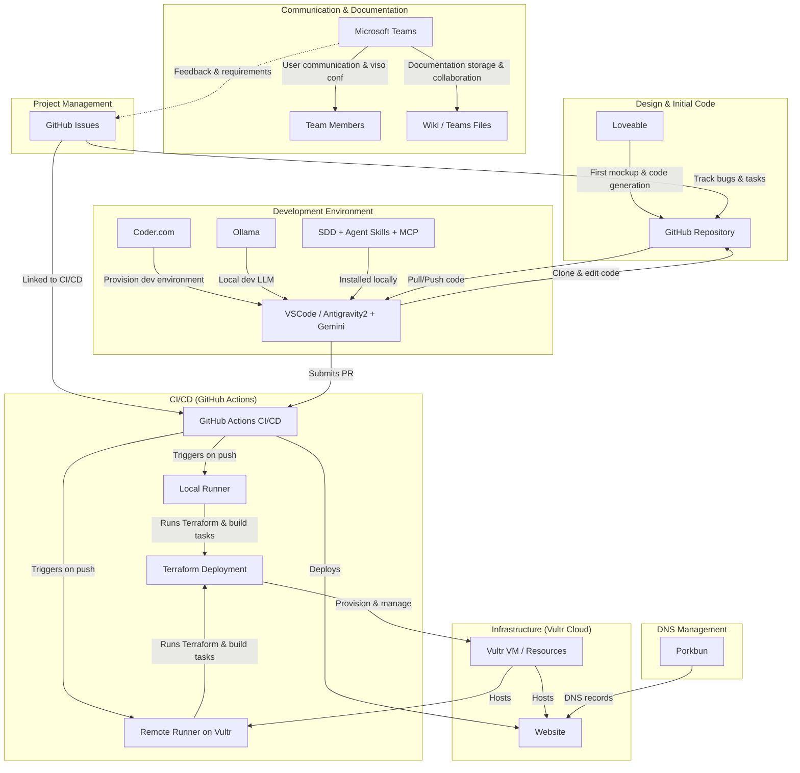

# TAG-pro

## Web site

First draft, init project

- create first mockup with Loveable, 
- get the code, push to github,
- get the code in VSCode copilot or Antigravity2/Gemini,
- install SDD and Agent Skills and MCP, 
- ollama for dev locally 
- infra in Vultr cloud provider
- issues are in Github
- CICD in Github, with 2 runners
- 1 local runner connected to Github
- 1 remote runner in Vultr 
- Microsoft Teams for users communication and viso conf
- Microsoft Teams for documentation 
- Porkbun for managing DNS
- Terraform will be used for all deployment 
- Coder.com for provisioning dev env (connected to plugin VSCode)
- the CICD deploy with terraform the infra and the website

## Schema infrastructure

