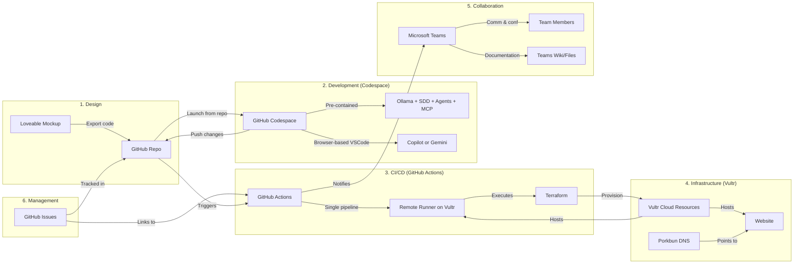

# TAG-pro

## Web site

📋 Optimized Project Setup with GitHub Codespaces

Phase 1: Initial Design & Code Generation

    Create first mockup with Loveable
    Export/generate the code from Loveable
    Push code directly to GitHub repository

Phase 2: Development Environment (All-in-One Codespace)

    Launch GitHub Codespace from repository (pre-configured devcontainer)
    Automatically includes:
        VSCode with Copilot OR Antigravity2/Gemini extension
        SDD (Software Development Dashboard) pre-installed
        Agent Skills framework pre-configured
        MCP (Model Context Protocol) ready to use
        Ollama running locally within the Codespace
        Terraform CLI pre-installed
        GitHub CLI for issue management
    No Coder.com needed - Codespace replaces it entirely
    No local setup - everything runs in cloud browser

Phase 3: Infrastructure (Vultr Cloud Provider)

    All infrastructure deployed on Vultr cloud provider
    DNS managed by Porkbun
    Infrastructure as Code using Terraform

Phase 4: CI/CD Pipeline (Simplified)

    GitHub Actions for CI/CD (single source of truth)
    Only 1 runner needed (remote runner in Vultr)
    ❌ Local runner removed (Codespace handles local testing)
    ✅ 1 remote runner on Vultr for production deployments
    CI/CD triggers:
        Push to main branch → Deploy to production
        Pull request → Deploy to staging environment

Phase 5: Terraform Deployment

    Terraform manages ALL deployments:
        Vultr infrastructure (VMs, networking, firewall)
        Website hosting environment
        Remote runner provisioning
        DNS records (via Porkbun integration)
    CI/CD pipeline executes Terraform automatically

Phase 6: Collaboration & Communication

    Microsoft Teams for:
        User communication and support
        Video conferences with stakeholders
        Documentation (Teams Wiki or Files)
        Deployment notifications (via webhook to GitHub Actions)

Phase 7: Project Management
    GitHub Issues for:
        Bug tracking
        Feature requests
        Sprint planning
        Linked directly to pull requests and commits

## Schema infrastructure

